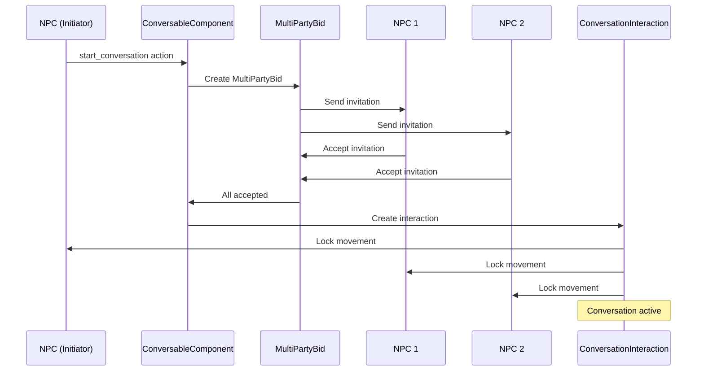
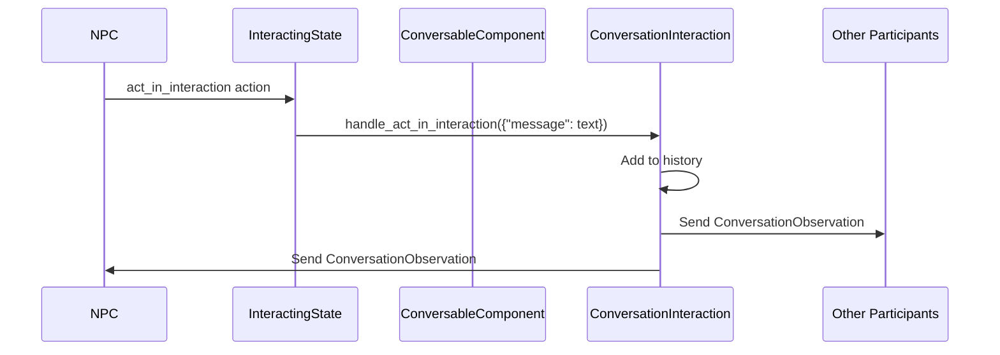

# Conversation System

## 1. Overview

The conversation system enables multi-party conversations between NPCs using a protocol-based approach with invitations, message exchange, and participant management. It's built on top of the interaction system using specialized components and state management.

### System Components
```
Conversation System
├── ConversableComponent (npcs/components/conversable_component.gd) - Enables NPCs to have conversations
├── ConversationInteraction (interactions/conversation_interaction.gd) - Manages conversation state and history
├── MultiPartyBid (interactions/multi_party_bid.gd) - Handles invitation protocol
├── InteractingState (npcs/controller/interacting_state.gd) - Standard state used during conversations
└── ConversationObservation (npcs/observations/conversation_observation.gd) - Updates sent to backend
```

**Note:** Conversations are handled through the standard interaction system. There is no dedicated ConversingState - NPCs in conversations use the InteractingState like any other interaction.

## 2. Core Components

### ConversableComponent (`src/field/npcs/components/conversable_component.gd`)
An NPC component that enables conversation capabilities.

**Key Features:**
- Extends `NpcComponent` (which extends `EntityComponent`)
- Provides `ConversationInteractionFactory` for creating conversations
- Manages conversation range detection
- Handles message sending through the current conversation interaction

**Key Methods:**
- `send_message(message: String)`: Sends a message in the current conversation
- `can_start_conversation_with(targets: Array[NpcController])`: Validates conversation preconditions
- `get_interaction_factories()`: Returns the conversation factory

### ConversationInteraction (`src/field/interactions/conversation_interaction.gd`)
A specialized `StreamingInteraction` that manages multi-party conversation state.

**Key Features:**
- Supports 2-10 participants
- Maintains conversation history (last 5 messages)
- Generates unique conversation IDs
- No adjacency requirement (uses conversation range instead)
- Locks participant movement during conversation

**State Management:**
- `conversation_id`: Unique identifier for the conversation
- `conversation_history`: Array of message dictionaries with:
  - `speaker`: NPC name
  - `message`: Text content
  - `timestamp`: When the message was sent
- `start_time`: When the conversation began

**Lifecycle Hooks:**
- `_on_start()`: Initializes conversation state
- `_on_participant_joined()`: Locks movement, sends initial observation
- `_on_participant_left()`: Unlocks movement, handles cleanup
- `_on_end()`: Ensures all participants are properly cleaned up

### MultiPartyBid (`src/field/interactions/multi_party_bid.gd`)
Manages the invitation protocol for multi-party interactions.

**Key Features:**
- Extends `InteractionBid` with multi-participant support
- Tracks invited participants and their responses
- Implements timeout mechanism (5 seconds default)
- Requires all participants to accept for success

**Invitation Flow:**
1. Initiator creates `MultiPartyBid` with invited participants
2. Each invited NPC receives `InteractionBidObservation`
3. NPCs can accept or reject the invitation
4. If all accept within timeout, bid is accepted
5. If any reject or timeout expires, bid is rejected

### Conversation State Management
Conversations use the standard `InteractingState` rather than a dedicated state.

**During Conversations:**
- NPCs remain in `InteractingState` like any other interaction
- Movement is locked by the `ConversationInteraction` itself (via `_handle_participant_joined/left`)
- Messages are sent using the generic `act_in_interaction` action with a "message" parameter
- Leaving is handled through the standard `cancel_interaction` action

**Allowed Actions in InteractingState:**
- `act_in_interaction`: Send messages or perform other interaction-specific actions
- `cancel_interaction`: Leave the conversation and return to idle
- `continue`: Stay in conversation (no-op)

**Implementation Note:** The conversation system is fully implemented. NPCs can start conversations through the interaction bid system using MultiPartyBid. The InteractionContext system handles both single-party and multi-party interactions through a single context type.

## 3. Protocol Flow

### Starting a Conversation



### Message Exchange



## 4. Conversation Events

The system uses dedicated events for conversation management:

### ConversationInvitationEvent
- Sent when an NPC is invited to a conversation
- Contains: inviter, invited NPCs, bid reference

### ConversationMessageEvent
- Sent when a message is added to a conversation
- Contains: conversation ID, speaker, message text

### ConversationEndedEvent
- Sent when a conversation terminates
- Contains: conversation ID, reason for ending

## 5. Backend Integration

### Observations
NPCs receive `ConversationObservation` updates containing:
- Conversation ID
- Current participants
- Recent message history (last 5 messages)
- Conversation duration

### Actions
The backend can trigger these conversation-related actions:
- `interact_with`: Start a conversation by targeting another NPC with the conversation interaction
- `act_in_interaction` with `{"message": "text"}`: Send a message in current conversation  
- `cancel_interaction`: Leave the current conversation and return to idle

## 6. Design Decisions

### Why Movement Locking?
Conversations lock movement to:
- Maintain visual coherence (NPCs stay together)
- Simplify state management
- Prevent conversation abandonment through movement

### Why No Adjacency Requirement?
Unlike most interactions, conversations:
- Can happen at a distance (within conversation range)
- Model verbal communication, not physical interaction
- Allow for more natural group formations

### Why Streaming Observations?
Conversations are dynamic with:
- Multiple participants contributing
- Ongoing message history
- State changes as participants join/leave

## 7. Configuration

### ConversableComponent Properties
- `conversation_range`: Maximum distance for starting conversations (default: 5.0)

### ConversationInteraction Limits
- Minimum participants: 2
- Maximum participants: 10
- Message history limit: 5 most recent messages

## 8. Implementation Status & Design Philosophy

The conversation system demonstrates the project's core design principle of scalability through generic, composable systems. Rather than creating specialized states and actions for every interaction type, conversations leverage the existing interaction framework.

### Architectural Benefits
- **Unified System**: Conversations use the same InteractingState and action patterns as all other interactions
- **Composability**: Any interaction can be made multi-party by implementing the MultiPartyBid protocol
- **Extensibility**: New interaction types can be added without modifying the state machine
- **Consistency**: All interactions follow the same lifecycle patterns and event flow

### Implementation Status
The conversation system is fully implemented with multi-party coordination support.


## 9. Example Usage

### Starting a Conversation
```gdscript
# Backend sends action to NPC
{
    "type": "interact_with",
    "parameters": {
        "item_name": "npc_2",  // Target NPC with ConversableComponent
        "interaction_name": "conversation"
    }
}
# This creates a MultiPartyBid and invites nearby NPCs through the interaction system
# Uses InteractionContext with GROUP type for state management
```

### Sending a Message
```gdscript
# Backend sends action to NPC in conversation
{
    "type": "act_in_interaction",
    "parameters": {
        "message": "How is everyone doing?"
    }
}
```

### Leaving a Conversation
```gdscript
# Backend sends action to NPC in conversation
{
    "type": "cancel_interaction",
    "parameters": {}
}
```